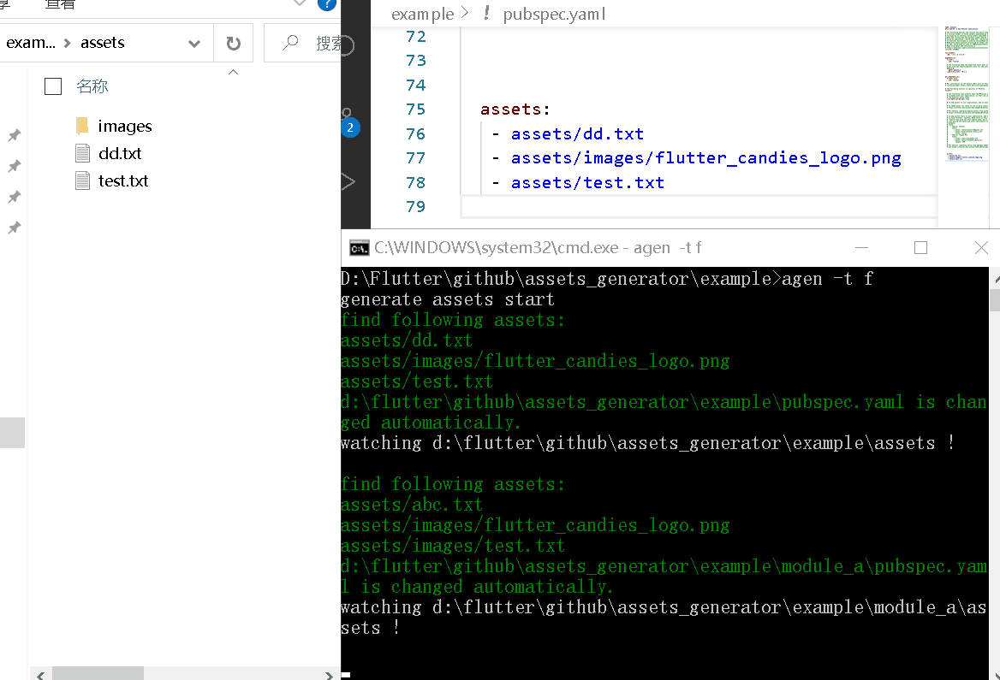

# **buatbesok_flutter_assets_generator**

Buatbesok flutter tool to generate assets configs in pubspec.yaml and assets as constant variables automatically for Repro structured project

## **Preview**



## **Contents**

- [**buatbesok\_flutter\_assets\_generator**](#buatbesok_flutter_assets_generator)
  - [**Preview**](#preview)
  - [**Contents**](#contents)
  - [**Getting Started**](#getting-started)
    - [1. Target Environement](#1-target-environement)
    - [2. Package Activation](#2-package-activation)
  - [**Use Cases**](#use-cases)
    - [All `assets_generator` Commands](#all-assets_generator-commands)
    - [Example `assets_generator` Command](#example-assets_generator-command)
    - [Example Usage In Project](#example-usage-in-project)
    - [Example Usage In Module](#example-usage-in-module)

## **Getting Started**

### 1. Target Environement

| Platform       | Pub Cache Location      |
| -------------- | :---------------------: |
| macOS          | $HOME/.pub-cache/bin    |
| Windows*       | %APPDATA%\Pub\Cache\bin |
| Linux          | $HOME/.pub-cache/bin    |

- case using macos and bash flavour is zshrc
- open Terminal
- run

```.
cd ~
```

- run

```.
nano .zshrc
```

- case pub cache location in `Users/jagad/`
- copy and paste

```.
#? buatbesok flutter assets generator
export PATH="$PATH":"/Users/jagad/.pub-cache/bin"
```

- save and restart terminal

### 2. Package Activation

to activate this package, please do this steps

- run

```.
dart pub global activate --source git https://github.com/Buat-Besok/buatbesok_flutter_assets_generator.git`
```

- readmore [dart pub global documentation](https://dart.dev/tools/pub/cmd/pub-global)

## **Use Cases**

### All `assets_generator` Commands

```.
-h, --[no-]help       Help usage
-p, --path            Flutter project root path
                      (defaults to ".")
-f, --folder          The root folder of assets
                      (defaults to "assets")
-w, --[no-]watch      Whether continue to monitor the changes of assets
                      (defaults to on)
-t, --type            The type in pubsepec.yaml
                      "d" means directory "- assets/images/"
                      "f" means file      "- assets/images/xxx.jpg"
                      (defaults to "d")
-s, --[no-]save       Whether save the arguments into the local
                      It will execute the local arguments if run "assets_generator"
                      without any arguments
-o, --out             The path of const Class
                      (defaults to "lib/app/generated")
-r, --rule            The rule for the names of assets' consts
                      "lwu"(lowercase_with_underscores) : "images_xxx_jpg"
                      "uwu"(uppercase_with_underscores) : "IMAGES_XXX_JPG"
                      "lcc"(lowerCamelCase)             : "imagesXxxJpg"
                      (defaults to "lwu")
-c, --class           The name of const Class
                      (defaults to "Assets")
    --const-ignore    The regular to ignore some consts
```

### Example `assets_generator` Command

```.
assets_generator -t f
```

### Example Usage In Project

```.
Image.asset(Assets.images_xxx_jpg);
```

### Example Usage In Module

```.
Image.asset(
  Assets.images_xxx_jpg,
  package: Assets.package,
);
```
